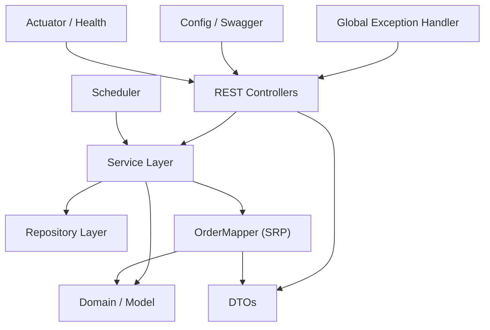

# Order Processing System — Implementation Plan

> **Status**: ✅ All phases complete. This document serves as a historical record of the build process and the architectural decisions made.

---

## 1. Architecture

### Architecture Style: Modular Monolith (Layered)

A single deployable Spring Boot application with clear internal boundaries between layers. Uses **profile-based YAML configuration** (`dev`, `stage`, `prod`) and **Docker** for containerization.

### Layer Diagram



| Layer | Responsibility |
|---|---|
| **Controller** | HTTP request/response, input validation, thin delegation to service |
| **Service** | All business logic, state transition rules, orchestration |
| **Mapper** | DTO ↔ Entity conversion (extracted per SRP) |
| **Repository** | Data access via Spring Data JPA |
| **Domain/Model** | JPA entities (immutable IDs, safe `equals`/`hashCode`), state-machine enum (`OrderStatus`) |
| **DTO** | API request/response shapes — decoupled from entities |
| **Exception** | Centralized `@ControllerAdvice` with DRY `buildErrorResponse()` helper |
| **Scheduler** | `@Scheduled` background job calling service layer |
| **Config** | Swagger/OpenAPI, scheduling enablement |

### Key Design Decisions

1. **Entities ≠ DTOs**: Database entities are never exposed in API responses. Dedicated DTOs with explicit mapping via `OrderMapper`.
2. **State machine in enum (OCP)**: `OrderStatus` encapsulates its own transition rules via `canTransitionTo()`. Adding a new status requires zero changes to services.
3. **Scheduler is thin**: It calls the service method; all transition logic lives in the service.
4. **Validation at boundary**: `@Valid` + Bean Validation on DTOs at the controller level.
5. **H2 in-memory for all profiles**: Zero setup. Docker deployment also uses H2 (embedded) to keep the project self-contained.
6. **Profile-based YAML config**: `application.yml` (common) + `application-dev.yml` / `application-stage.yml` / `application-prod.yml`.
7. **Immutable entities**: `Order.id`, `customerName`, and `createdAt` are write-once; class-level `@Setter` removed in favor of field-specific setters.
8. **JPA-safe identity**: `equals()`/`hashCode()` use DB identity, safe for `Set` collections and detached entities.

---

## 2. Delivery Phases — Completion Status

### Phase 1: Project Scaffolding & Domain Modeling ✅

| # | Task | Status |
|---|---|---|
| 1.1 | Create `pom.xml` with all dependencies | ✅ |
| 1.2 | Create `OrderProcessingApplication.java` | ✅ |
| 1.3 | Create `OrderStatus` enum with state-machine transitions | ✅ |
| 1.4 | Create `Order` entity with immutable fields and safe `equals`/`hashCode` | ✅ |
| 1.5 | Create `OrderItem` entity | ✅ |
| 1.6 | Create multi-profile YAML config (dev/stage/prod) | ✅ |
| 1.7 | Flyway migration scripts (`V1`, `V2`) | ✅ |

### Phase 2: DTOs, Validation & Exception Handling ✅

| # | Task | Status |
|---|---|---|
| 2.1 | `CreateOrderRequest` DTO with `@Valid` constraints | ✅ |
| 2.2 | `OrderItemRequest` DTO with validation | ✅ |
| 2.3 | `OrderResponse` and `OrderItemResponse` DTOs | ✅ |
| 2.4 | `ErrorResponse` DTO | ✅ |
| 2.5 | `OrderNotFoundException` | ✅ |
| 2.6 | `InvalidOrderStateException` | ✅ |
| 2.7 | `GlobalExceptionHandler` with DRY `buildErrorResponse()` helper | ✅ |

### Phase 3: Repository & Service Layer ✅

| # | Task | Status |
|---|---|---|
| 3.1 | `OrderRepository` with custom query methods | ✅ |
| 3.2 | `OrderService` interface | ✅ |
| 3.3 | `OrderServiceImpl` with all business methods | ✅ |
| 3.4 | `OrderMapper` component for DTO ↔ Entity mapping (SRP extraction) | ✅ |

### Phase 4: REST API & Swagger ✅

| # | Task | Status |
|---|---|---|
| 4.1 | `OrderController` with all endpoints (CRUD + pagination) | ✅ |
| 4.2 | `@Valid` on request bodies | ✅ |
| 4.3 | Proper HTTP status codes (201, 200, 404, 400, 409) | ✅ |
| 4.4 | `SwaggerConfig.java` with OpenAPI metadata | ✅ |
| 4.5 | Swagger UI verification | ✅ |

### Phase 5: Scheduler / Background Job ✅

| # | Task | Status |
|---|---|---|
| 5.1 | `@EnableScheduling` | ✅ |
| 5.2 | `OrderStatusScheduler` with configurable `fixedRate` | ✅ |
| 5.3 | Scheduler calls `orderService.processPendingOrders()` | ✅ |
| 5.4 | Logging for job execution | ✅ |
| 5.5 | Idempotency on empty result set | ✅ |

### Phase 6: Testing ✅

| # | Task | Status |
|---|---|---|
| 6.1 | `OrderServiceImplTest` — 13 unit tests (Mockito) | ✅ |
| 6.2 | `OrderControllerTest` — 9 integration tests (MockMvc) | ✅ |
| 6.3 | `OrderStatusSchedulerTest` — 2 unit tests | ✅ |
| 6.4 | All 24 tests passing | ✅ |

### Phase 7: Documentation ✅

| # | Task | Status |
|---|---|---|
| 7.1 | `README.md` (open-source quality with future scope + contribution rules) | ✅ |
| 7.2 | `docs/architecture.md` | ✅ |
| 7.3 | `docs/api.md` | ✅ |
| 7.4 | `docs/testing.md` | ✅ |
| 7.5 | `docs/decisions.md` | ✅ |
| 7.6 | `docs/deployment.md` | ✅ |
| 7.7 | `docs/assumptions.md` | ✅ |

### Phase 8: Containerization (Docker) ✅

| # | Task | Status |
|---|---|---|
| 8.1 | Multi-stage `Dockerfile` (Maven build → JRE runtime) | ✅ |
| 8.2 | `.dockerignore` | ✅ |
| 8.3 | Docker build & run verified | ✅ |

### Phase 9: Code Quality Refactoring ✅

| # | Task | Status |
|---|---|---|
| 9.1 | Extract `OrderMapper` component (SRP) | ✅ |
| 9.2 | Encapsulate state transitions in `OrderStatus` enum (OCP) | ✅ |
| 9.3 | DRY `GlobalExceptionHandler` with unified helper | ✅ |
| 9.4 | Immutable `Order` entity (restricted `@Setter`, protected no-args constructor) | ✅ |
| 9.5 | JPA-safe `equals()`/`hashCode()` on `Order` | ✅ |
| 9.6 | Replace `Collectors.toList()` with Java 17 `.toList()` | ✅ |
| 9.7 | Remove redundant manual `setUpdatedAt()` (rely on `@UpdateTimestamp`) | ✅ |
| 9.8 | Remove wildcard imports | ✅ |

### Phase 10: Health Monitoring & QA Automation ✅

| # | Task | Status |
|---|---|---|
| 10.1 | Add Spring Boot Actuator (`/actuator/health`) | ✅ |
| 10.2 | Create `qa/` directory with scenarios, scripts, and reports | ✅ |
| 10.3 | Automated API SIT script (`sit_api_tests.ps1`) | ✅ |
| 10.4 | Automated Scheduler SIT script (`sit_scheduler_tests.ps1`) | ✅ |
| 10.5 | All SIT tests passing on `stage` and `main` branches | ✅ |

---

## 3. Assumptions

| # | Assumption | Rationale |
|---|---|---|
| A1 | **No authentication/authorization** | Not mentioned in requirements; out of scope |
| A2 | **H2 in-memory database** for all profiles | Keeps setup zero-dependency; no external DB needed |
| A3 | **No payment or inventory integration** | Out of scope |
| A4 | **Order ID is auto-generated Long** | Simplest approach; UUID can be swapped later |
| A5 | **`customerName` is a simple string field** | No user management system |
| A6 | **`CANCELLED` is a terminal state** | Once cancelled, an order cannot be reactivated |
| A7 | **`SHIPPED`/`DELIVERED` set manually** (future scope) | Scheduler only handles PENDING → PROCESSING |
| A8 | **Price is per-item, stored as `BigDecimal`** | Avoids floating-point money issues |
| A9 | **Spring Boot 3.2.x** with Java 17 | Modern, LTS-compatible baseline |
| A10 | **Profile-based YAML config** (dev/stage/prod) | Industry standard |
| A11 | **Fixed-rate scheduler, not cron** | Simpler; `fixedRate` with configurable interval |
| A12 | **No soft deletes** | Orders are never deleted, only transitioned |

---

## 4. Verification Summary

### Automated Tests (CIT)
```bash
mvn test
# Result: BUILD SUCCESS — 24/24 tests passing
```

### System Integration Testing (SIT)
```powershell
# Start the app with fast scheduler for testing
mvn spring-boot:run -Dspring-boot.run.arguments="--app.scheduler.interval=5000"

# Run API tests
powershell -ExecutionPolicy Bypass -File qa/scripts/sit_api_tests.ps1

# Run Scheduler tests
powershell -ExecutionPolicy Bypass -File qa/scripts/sit_scheduler_tests.ps1
```

### Docker Verification
```bash
docker build -t order-processing-system .
docker run -p 8080:8080 order-processing-system
# Access http://localhost:8080/swagger-ui.html
```
